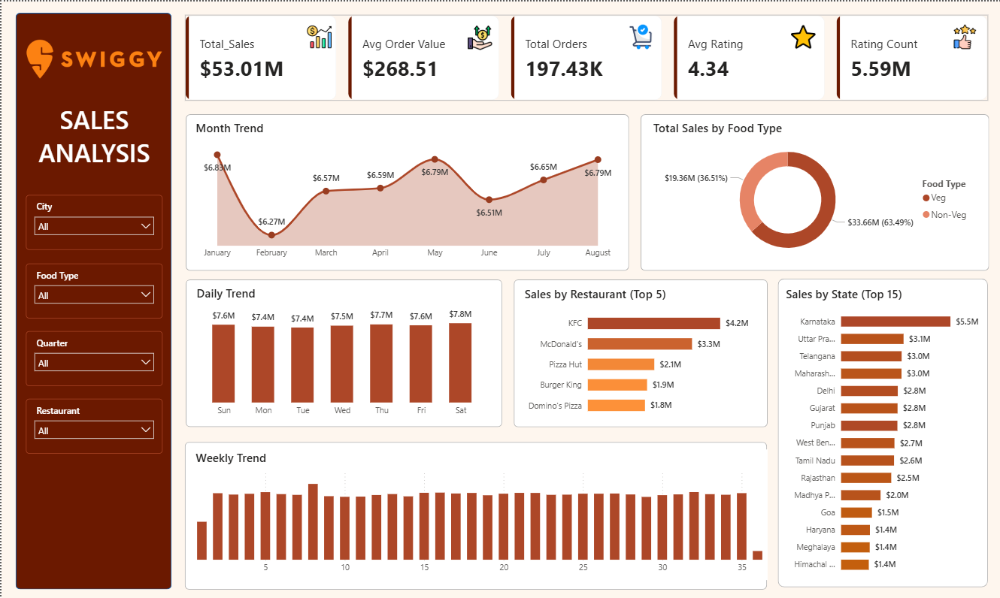
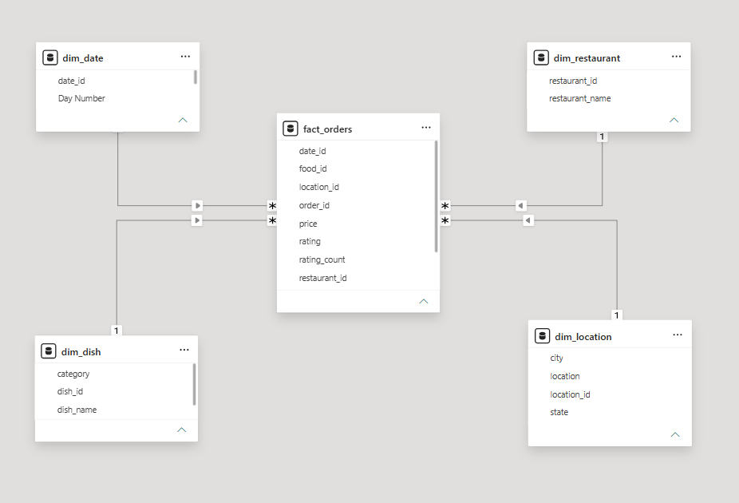

# Swiggy_Data_Analysis

## 1. Project Title / Headline
An end-to-end data analysis project exploring the Swiggy food delivery ecosystem. This project transforms transactional order data into actionable business intelligence, focusing on culinary performance, regional demand, and customer satisfaction metrics.

## 2. Short Description / Purpose
The Swiggy Data Analysis Project is an integrated solution designed to uncover patterns in food delivery data. By processing multiple dimension tables (Date, Location, Restaurant, Dish) and a central Fact table (Orders), this project enables deep-dive analytics into revenue trends, top-performing restaurants, and category-wise dish popularity.

## 3. Tech Stack
This project leverages the following technologies:
- **Power BI Desktop** - Core visualization engine for creating interactive dashboards and monitoring KPIs.
- **DAX (Data Analysis Expressions)** - Development of business logic for measures such as Total Revenue, Average Rating, and order-volume distributions.
- **Data Modeling** - Relational schema modeling connecting orders to geographic, temporal, and culinary dimensions.
- **Power Query** - Data transformation and ETL processes for raw transactional records.
- **PostgreSQL**  - Used to write queries, join tables, and calculate complex metric calculation
- **File Types** – `.pbix`, `.sql`,`.csv`

## 4. Data Source
**Source**: Swiggy Simulated Sales Dataset (2025)
**Location**: India
**Key Fields**: 
- fact_orders: Central transactional data
- dim_date: Temporal mapping for seasonality and trend analysis.
- dim_location: Geographic breakdown by State, City, and Local Area.
- dim_dish: Menu categorization (Category, Dish Name).
- dim_restaurant: Restaurant identification and entity mapping.

## 5. Features / Highlights
### • Business Problem
The project provides visibility into high-frequency food delivery operations, addressing the need for data-driven insights into regional performance variances, menu optimization, and overall customer satisfaction.

### • Goal of the Dashboard
To provide a structured analytical framework for:
- Monitoring revenue growth and order volume trends.
- Identifying "Hero Dishes" and top-performing restaurant chains.
- Analyzing geographic order density to understand regional market behavior.
- Evaluating customer satisfaction through rating count and score distribution.

### • Key Analytics and Metrics
**Business KPIs**
- Total Revenue: Measured in INR Millions.
- Order Throughput: Count of total orders processed.
- Satisfaction Indices: Average rating scores and rating-count frequency.
- Pricing Dynamics: Average price per dish and price-range order distributions.

**Performance Trends**
- Time-Series Analysis: Monthly and quarterly volume trends using dim_date.
- Day-of-Week Patterns: Identifying peak order velocity to optimize logistics.
- Regional Insights: State and City-level revenue contribution.

**Culinary & Restaurant Performance**
- Category Popularity: Ranking categories (e.g., North Indian, Snacks) by total orders.
- Dish Ranking: Identifying most popular menu items.
- Restaurant Leaders: Ranking top-order generating restaurants.

### Business Impact & Insights
- Optimized Inventory/Prep: By identifying top categories and peak days, restaurants can better manage demand.
- Strategic Expansion: Geographic insights help identify under-served cities versus high-density markets.
- Sentiment Analysis: Correlating ratings with specific dishes highlights quality control opportunities for restaurant partners.
- Pricing Strategy: Price-range segmentation assists in developing effective promotional bundles.

## 6. SQL Logic & Insights

1. Patient Demographics: Provide a count of patients grouped by their RACE,GENDER,MARITAL STATUS AND ETHINICITY.
```sql
SELECT gender,count(*) as patients_as_gender
FROM [hospital_db].[dbo].[patients]
GROUP BY gender;
```
```sql
SELECT race,count(*) as patients_as_race
FROM [hospital_db].[dbo].[patients]
GROUP BY race;
```
```sql
SELECT marital_status,count(*) as patients_as_marital_status
FROM [hospital_db].[dbo].[patients]
GROUP BY marital_status;
```
```sql
SELECT ethnicity,count(*) as patients_as_ethnicity
FROM [hospital_db].[dbo].[patients]
GROUP BY ethnicity;
```

2. Patients Check: List the cities and no of patients from each city from high to low
```sql
SELECT city,COUNT(*) AS total_patients
FROM [hospital_db].[dbo].[patients]
GROUP BY city
ORDER BY total_patients DESC;
```

3. Encounters over the years: Find the no of encounters over the years and order them according to years older to recent
```sql
SELECT YEAR(start) as year,COUNT(*) AS total_encounters 
FROM [hospital_db].[dbo].[encounters]
GROUP BY  YEAR(start)
ORDER BY YEAR(start);
```

4. Top Healthcare Payers: List the Payers that have covered the highest number of encounters AND also the highest amount of encounters
```sql
SELECT TOP 5 p.name as payer,COUNT(e.payer_coverage) AS total_encounters_covered
FROM [hospital_db].[dbo].[encounters] e
JOIN [hospital_db].[dbo].[payers] p ON e.payer = p.id
WHERE name != 'NO_INSURANCE'
GROUP BY p.name
ORDER BY total_encounters_covered DESC;
```
```sql
SELECT TOP 5 p.name as payer,ROUND(SUM(e.payer_coverage),2) AS total_amount_covered
FROM [hospital_db].[dbo].[encounters] e
JOIN [hospital_db].[dbo].[payers] p ON e.payer = p.id
WHERE name != 'NO_INSURANCE'
GROUP BY p.name
ORDER BY total_amount_covered DESC;
```

5. Specific Condition Search: Find all patients (First and Last name) who have a REASONDESCRIPTION of 'Hyperlipidemia'.
```sql
SELECT p.first_name,p.last_name,reason_description
FROM [hospital_db].[dbo].[encounters] e
JOIN [hospital_db].[dbo].[patients] p ON e.patient = p.id
WHERE reason_description = 'Hyperlipidemia'
GROUP BY p.first_name,p.last_name,reason_description;
```

6. Patient Lifecycle Segmentation: Categorize the entire patient population into three age-based segments:
   'Seniors' (> 60), 'Adults' (18-59), and 'Youth' (< 18). And give the no of count for each section
```sql
WITH Patient_Segmentation AS (
SELECT 
CASE
	when DATEDIFF(YEAR,birth_date,coalesce(death_date,GETDATE())) > 60 then 'Seniors (>60)'
	when DATEDIFF(YEAR,birth_date,coalesce(death_date,GETDATE())) between 18 and 59 then 'Adults (18-59)'
	else 'Youth (<18)'
END AS patient_segmentation
FROM [hospital_db].[dbo].[patients])
SELECT patient_segmentation,count(*) as total_patients
FROM Patient_Segmentation
GROUP BY patient_segmentation
ORDER BY total_patients DESC;
```

7. Cost Discrepancy: Calculate the difference between TOTAL_CLAIM_COST and PAYER_COVERAGE. List the Patient where the "Out of Pocket" amount is more than 50000.
```sql
SELECT first_name,last_name,payers.name,
	ROUND(total_claim_cost,2) AS total_claim_cost,
	ROUND(payer_coverage,2) as payers_coverage,
	ROUND((total_claim_cost - payer_coverage),2) AS out_of_pocket
FROM [hospital_db].[dbo].[encounters]
JOIN [hospital_db].[dbo].[patients] ON encounters.patient = patients.id
JOIN [hospital_db].[dbo].[payers] on encounters.payer = payers.id
WHERE ROUND((total_claim_cost - payer_coverage),2) > 50000
ORDER BY out_of_pocket DESC;
```

8. Stay Duration: Calculate the average length of stay (in minutes) for each ENCOUNTERCLASS.
```sql
SELECT encounter_class,AVG(DATEDIFF(MINUTE,start,stop)) AS total_stay
FROM [hospital_db].[dbo].[encounters]
GROUP BY encounter_class
ORDER BY total_stay DESC;
```

9. High-Volume Regional Hub Analysis: Identify the major geographic hubs by listing all cities that have surpassed a threshold of 500 total healthcare encounters.
```sql
SELECT city,COUNT(encounters.id) AS total_encounters,ROUND(SUM(total_claim_cost),2) as total_claim_cost
FROM [hospital_db].[dbo].[patients]
JOIN [hospital_db].[dbo].[encounters] on patients.id = encounters.patient
GROUP BY city
HAVING COUNT(encounters.id) > 500
ORDER BY total_encounters DESC;
```

10. Payer Revenue Attribution Analysis: Calculate the total revenue generated from each healthcare insurance provider to identify the hospital's primary financial contributors.
```sql
SELECT payers.name,ROUND(SUM(base_encounter_cost),2) AS total_base_encounter_cost
FROM [hospital_db].[dbo].[encounters]
JOIN [hospital_db].[dbo].[payers]
ON encounters.payer = payers.id
GROUP BY payers.name
ORDER BY total_base_encounter_cost DESC;
```

11. Financial Trend Analysis: Calculate a 7-Day Moving Average of the total daily healthcare revenue for the first quarter of 2021.
```sql
WITH DailyRevenue AS (
	SELECT 
        CAST(start AS DATE) AS service_date,
        ROUND(SUM(TOTAL_CLAIM_COST),2) AS daily_total
    FROM [hospital_db].[dbo].[encounters]
    WHERE start >= '2021-01-01' AND start < '2021-04-01'
    GROUP BY CAST(START AS DATE)
SELECT service_date,
	daily_total,
	ROUND(AVG(daily_total) Over(ORDER BY service_date ROWS BETWEEN 6 PRECEDING AND CURRENT ROW),2) AS [7_day_moving_avg]
FROM DailyRevenue
ORDER BY service_date
```

12. Ranked Expenses: Within each CITY, rank patients by their total healthcare spend from highest to lowest. Show only the top 3 patients per city.
```sql
WITH PatientSpending AS (
    SELECT p.id AS patient_id,p.city,p.first_name,p.last_name,
	ROUND(SUM(e.total_claim_cost),2) AS Total_Healthcare_Spend
    FROM [hospital_db].[dbo].[patients] p
    JOIN [hospital_db].[dbo].[encounters] e ON p.Id = e.patient
    GROUP BY p.id,p.city,p.first_name,p.last_name
), RankedSpending AS (
    SELECT city,first_name,last_name,Total_Healthcare_Spend,
        ROW_NUMBER() OVER (PARTITION BY CITY ORDER BY Total_Healthcare_Spend DESC) as Spend_Rank
    FROM PatientSpending
)
SELECT city,first_name,last_name,Total_Healthcare_Spend,Spend_Rank
FROM RankedSpending
WHERE Spend_Rank <= 3
ORDER BY CITY;
```

13. Month-over-Month Revenue: Using a CTE, calculate the total TOTAL_CLAIM_COST per month for the year 2021, and show the percentage growth compared to the previous month.
```sql
WITH Monthly_Revenue as (
SELECT MONTH(start) as month_number,ROUND(SUM(total_claim_cost),2) as current_month_revenue
FROM [hospital_db].[dbo].[encounters]
WHERE YEAR(start) = 2021
GROUP BY MONTH(start)
), Revenue_Comparision as (
SELECT month_number,current_month_revenue,
	LAG(current_month_revenue) over(order by month_number) as previous_month_revenue
FROM Monthly_Revenue
);
SELECT month_number,current_month_revenue,previous_month_revenue,
CONCAT(ROUND(((current_month_revenue - previous_month_revenue) / previous_month_revenue) * 100,2),'%') as MoM_Growth_Pct
FROM Revenue_Comparision;
```

14. Retention & Gap Analysis: Identify "Lapsed Patients" who had a gap of more than 2 years (730 days) between consecutive healthcare visits.
```sql
WITH Gap_Encounter as (
SELECT p.id,p.first_name,p.last_name,
	CAST(e.start AS date) as curent_visit,
	LAG(CAST(e.start as date)) OVER(partition by p.id ORDER BY e.start) AS previous_visit
FROM [hospital_db].[dbo].[patients] p
JOIN [hospital_db].[dbo].[encounters] e on p.id = e.patient
)
SELECT first_name,last_name,curent_visit,previous_visit,
DATEDIFF(DAY,previous_visit,curent_visit) as days_btw_visits
FROM Gap_Encounter
WHERE DATEDIFF(DAY,previous_visit,curent_visit) > 730
ORDER BY first_name,last_name;
```

15. Patient Population Stratification & Revenue Analysis: Segment the patient database into three financial tiers
    'High'(>5k),'Medium'(1k-5k) and 'Low'(<1k) based on their total lifetime expenditure to identify high-utilization groups.
```sql
WITH PatientRevenue AS (
    SELECT 
        PATIENT,
        SUM(TOTAL_CLAIM_COST) AS Lifetime_Spend
    FROM [hospital_db].[dbo].[encounters]
    GROUP BY PATIENT
), TieredPatients AS (
    SELECT 
        PATIENT,
        Lifetime_Spend,
        CASE 
            WHEN Lifetime_Spend > 5000 THEN 'High Value (>5k)'
            WHEN Lifetime_Spend BETWEEN 1000 AND 5000 THEN 'Medium Value (1k-5k)'
            ELSE 'Low Value (<1k)'
        END AS Revenue_Tier
    FROM PatientRevenue
)
SELECT 
    Revenue_Tier,
    COUNT(PATIENT) AS Patient_Count,
    ROUND(SUM(Lifetime_Spend), 2) AS Tier_Total_Revenue,
    ROUND(AVG(Lifetime_Spend), 2) AS Avg_Spend_Per_Patient
FROM TieredPatients
GROUP BY Revenue_Tier
ORDER BY Tier_Total_Revenue DESC;
```

## 7. Screenshots / Demos



    

